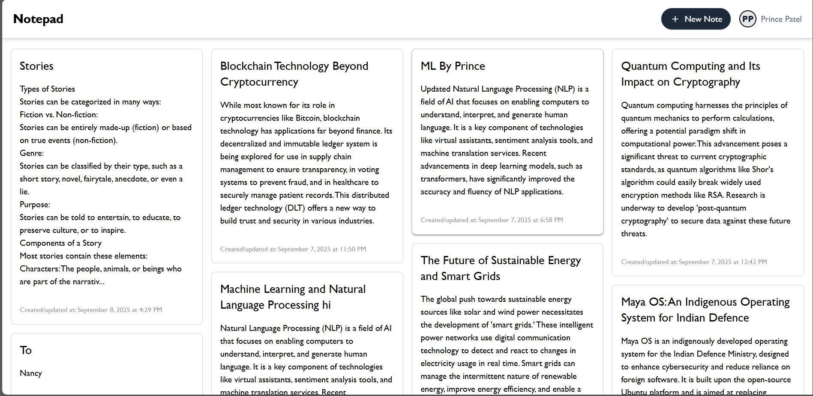
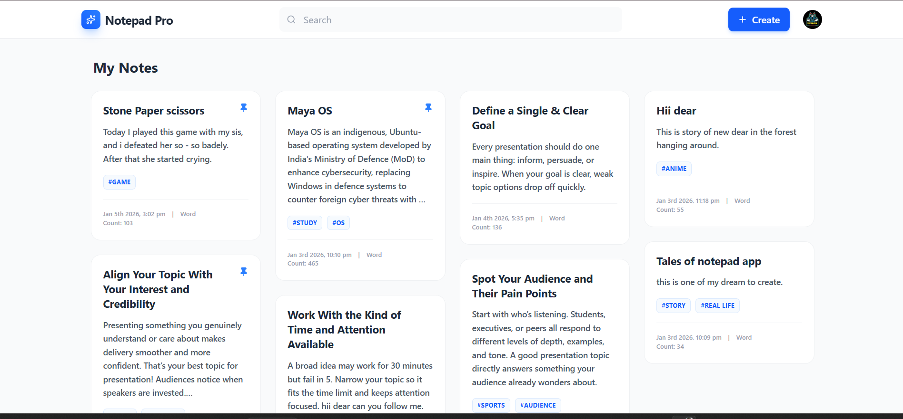
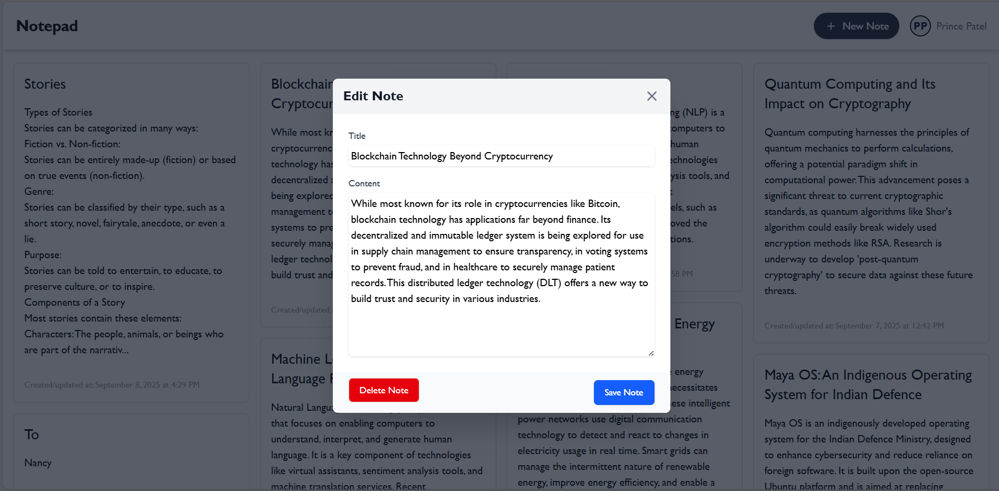
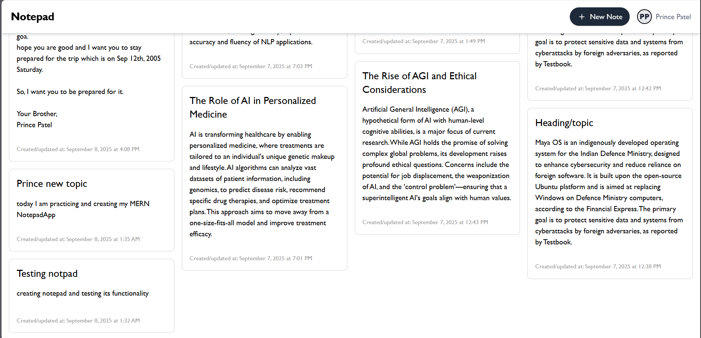

# Notepad-App

  
  
  
  
  
  
  

---

## 📌 Overview
A full-stack **Notepad Application** that allows users to create, edit, and manage notes easily.  
Built with a modern **frontend** and a robust **backend**, the app provides a smooth and responsive experience.  

---

## 📸 Screenshots

<div>
  <!--   -->
  
  
  <!--  -->
</div>

---

## 🚀 Features
-  Create and save notes  
-  Edit and update notes  
-  Delete unwanted notes  
-  Organize notes with a simple UI  
-  Persistent storage (database integration)  
-  Fully responsive design (mobile + desktop)  
-  Fast and scalable backend  

---

## 🛠️ Tech Stack

### Frontend
-  React (with Hooks / Context API)  
-  Tailwind CSS / CSS3  
-  Vite / CRA  

### Backend
-  Node.js & Express.js  
-  MongoDB / Firebase  
-  RESTful APIs  

---

## 📂 Folder Structure
```bash
notepad-app/
├── client/              # React-based UI
│   ├── public/            
│   ├── src/               
│   └── package.json       
│
├── server/               # Node.js + Express server
│   ├── routes/            
│   ├── models/            
│   ├── controllers/       
│   ├── server.js          
│   └── package.json       
│
└── README.md              # Documentation

---
```

## ⚙️ Installation & Setup

Follow these steps to set up and run the project locally:

### 1.Clone the Repository
```bash
git clone https://github.com/itz-Prince2022/Notepad-Pro.git
cd notepad-app
```

### 2.Setup Backend
```bash
cd server
npm install        # Install backend dependencies
node server.js       # Start backend server
```

### 3.Setup Frontend
```bash
cd client
npm install        # Install frontend dependencies
npm run dev         # Start frontend development server
```

### 4.Access the App
Open your browser and go to:  
👉 http://localhost:3000

---

### 🔑 Environment Variables
```bash
Create a `.env` file in the backend folder and add:
MONGO_URI=your_mongodb_connection_string
PORT=5000
JWT_SECRET=your_secret_key
```

---

### 📌 API Endpoints (Backend)
```bash
GET    /api/notes       # Get all notes
POST   /api/notes       # Create new note
PUT    /api/notes/:id   # Update a note
DELETE /api/notes/:id   # Delete a note
```

---

## 🤝 Contributing

Contributions are welcome!  
1. Fork this repo  
2. Create a new branch (feature-branch)  
3. Commit your changes
4. Push to your branch
5. Open a Pull Request
